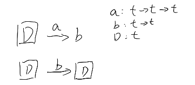

# 模型

本章试图建立一个模型来解释函数式的想法,为什么要这样设计.

\*这些全是我自己想的,不一定对.

## 数据和函数

考虑数据和函数的计算关系, 可以画成这样.

其中D表示数据. f,g,h表示函数.

一个数据被一个函数映射为另一个数据.

依据数据不可变原则, 每个数据被计算出来后都是固定的, 我们可以放心的将它再传给其他函数.

## 多参函数和柯里化

那么一个函数是多参数的怎么办呢?我们用柯里化解决,在这里我们也可以表示.

D是一个数据, 它被函数a映射为b, b也是一个数据.

但注意到, 函数其实也是一种数据, 如果b是一个函数的话, 我们自然可以再拿他做计算.

所以其实一切都是数据, 函数只是数据的一种, 一个数据是否能被当成函数使用, 取决于它的kind类型.

## 上下文

我们扩充了数据的定义, 通常我们只认为数据表示一个值, 但这里, 我们的数据有更多功能.

例如Maybe类型的数据, 表示"可能存在(也可能不存在)的值", IO类型的数据则表示"有副作用的值".

在这个意义上,函数表示"可以映射数据到数据的数据".

他们也是数据,他们也可以被传来传去,他们不一定是一个值,会带有更多东西,我们称为上下文.

一切操作,包括副作用,都被封装到了上下文里.

之后,我们再提供一些配合数据类型使用的函数,就可以表达我们想要的逻辑了.

## 重载

给定一个类型的数据和一个函数,通过这个函数操作这个数据,会得到另一个数据.

但如果函数b的行为随着D的类型不同而不同,

当然最后得到的D’也不同.

这就叫重载.

并不需要改变数据的定义,我们可以想象这里的b不是一个”实体”,只是一个”代号”.

当D被确定时,b才会被确定.

类似于形式参数,只是b是在调用时由系统自动推断的.

 

系统如何知道应该如何推断?

依靠类型类的定义.

即,每个数据除了类型外,还有类型类,

然后我们在类型类层面上规定了一些”代号”和”推断规则”.

 

这样,我们就有了一些”通用”的函数,他们对很多数据都可以使用,

但实际用起来的时候,不同类型的数据效果其实不一样.

这算是避免了一些撞名的尴尬.

 

用a函数处理数据D和用a函数处理数据E,他们的行为差别太大好像也不合适.

所以我们还可以在上面建立一套抽象的逻辑规则.

比如,我们定义”加”这个函数,对数字他是数学的加,对字符串他是拼接.就很说得通.

“加”这个概念更严格的说是”合在一起”.这是一个很通用的抽象逻辑,叫半群.

类型类描述的就是这种东西,他借用了数学里抽象代数的部分逻辑.

还有范畴论的一些逻辑.

同时会有一些很自然的想法,比如,a加b和b加a应该是一样的.

这就是类型类的法则了.

这是很合适的规则,规则除了约束,还可以带来更好的健壮性.

 

这些类型类的逻辑都是自然的,并且来自数学也很靠谱,

如果你要定义一个数据类型,尽可能实现合适的类型类会更容易让人理解.

## 结论

所以除了基础语法外,剩下的实际上是去熟悉各种各样的类型和类型类.

下面也会如此介绍.

